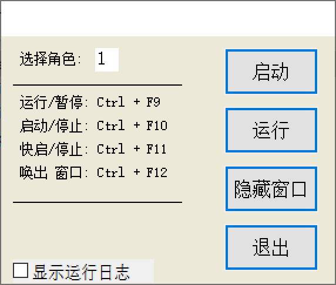

# AutoTG
auto test GUI or Game by writing lua scripts.

项目最初是为了实现DNF辅助刷副本用的，未来希望扩展成游戏自动化测试工具或者是GUI程序自动化测试工具。
# 计划
- 整理项目使其易于使用
- 重构项目，发展成自动化测试工具
- 添加OCR功能
- 整合深度学习技术，完善图像匹配技术
# 资料
- https://gym.openai.com/
- https://github.com/openai/retro
- https://github.com/deepmind/lab
- https://github.com/microsoft/malmo
- https://github.com/deepmind/open_spiel
# 说明
gpatm是GUI程序，负责管理gpatc运行、暂停、启动、停止等操作



gpatc是控制台程序也是lua解释器，封装了键鼠控制、截图及图像识别、windows窗口控制等功能，提供给lua脚本调用。gpatc还是实现了脚本加解密，账号卡密认证客户端功能。

gpatc.exe可独立运行，“gpatc.exe -run=false -enc -script=gp.script -sconfig=gps.conf -uconfig=gpu.conf -lic=gp.lic -role=1”

lua脚本调用gpatc的截图和图像识别接口判断位置，在调用键盘鼠标接口控制键鼠（键鼠可软件实现，也可硬件实现）
# 类似软件
- TC：http://www1.tyuyan.net/
- 按键精灵：http://www.anjian.com/
- Airtest：https://github.com/AirtestProject/Airtest

# 版本区别

- periphery-o : gpatm.exe、gpatc.dll
- periphery-t : gpatm.exe、gpatc.exe

# 编译依赖

[xv_dep](https://github.com/coolxv/xv_dep):编译依赖的第三方库及其头文件

# 编译目录布局
```
AutoTG
│   README.md
│
└───xv_dep
│   │
│   └───fflua
│       │   ...
│   
└───periphery-o
│   │
│   └───periphery_c
│   └───periphery_m
│   
└───periphery-t
│   │
│   └───periphery_c
│   └───periphery_m

```
# 运行依赖
[zh_script](https://github.com/coolxv/zh_script):运行时的示例脚本目录

[xv_res](https://github.com/coolxv/xv_res):运行时的依赖库，windows自身库，有的机器上没有

[de_srv](https://github.com/coolxv/de_srv):账号卡密认证服务，在linux部署

[atmega32u4-usb-dev](https://github.com/coolxv/atmega32u4-usb-dev):硬件模拟键盘鼠标

[an_tool可选](https://github.com/coolxv/an_tool):对脚本进行加密，程序加壳等安全操作

# 运行目录布局
```
zh_script
│
└───使用说明
└───lib                   //xv_res
│   gp.lic
│   gp.script 
│   gp.lic
│   gps.conf 
│   gpu.conf
│   gpatc.dll             //gpatc.exe  
│   km.dll                //atmega32u4-usb-dev, keyboard and mouse by writing code control
│   gpatm.exe 
│   ...

```

# 程序使用

双击运行 gpatm.exe
